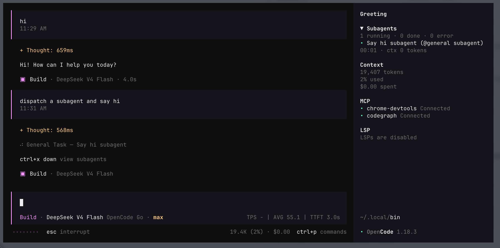
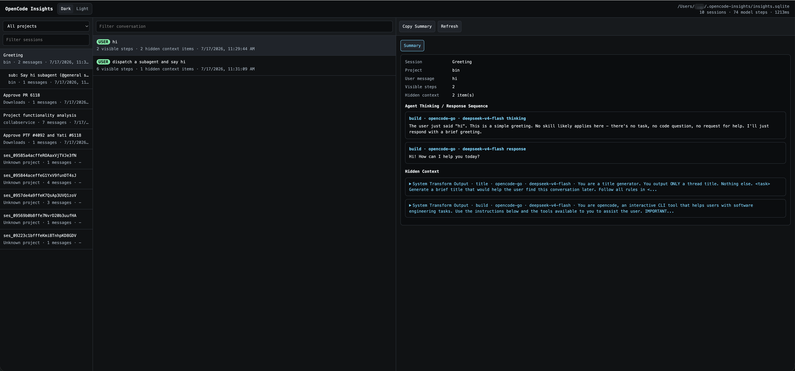

# opencode-insights

Local OpenCode observability for live TPS, subagent status, and full-fidelity request/session inspection.

## Install

Install globally with OpenCode's plugin manager:

```bash
opencode plugin @rejacky/opencode-insights --global
```

Restart OpenCode after installing the plugin.

On startup, the plugin creates a user-local `opencode-insights` command shim in:

```text
~/.local/bin
```

Make sure that directory is on your `PATH`, then run the CLI directly:

```bash
opencode-insights doctor
```

## Update

`opencode plugin` does not re-install or upgrade already-cached packages. To update to the latest version, clear the cached copy and reinstall:

```bash
rm -rf ~/.cache/opencode/packages/node_modules/@rejacky/opencode-insights
opencode plugin @rejacky/opencode-insights --global
```

Then restart OpenCode.

You can also run the latest published version directly via `npx` without reinstalling:

```bash
npx -y -p @rejacky/opencode-insights opencode-insights doctor
```

## Preview



Inspect captured sessions with the web viewer:

```bash
opencode-insights open
```

OpenCode Insights viewer listening at http://127.0.0.1:8765



## Uninstall

Remove this plugin from `opencode.json` / `opencode.jsonc`, remove it from `tui.json`, and delete the local Insights database files:

```bash
opencode-insights uninstall
```

Preview the cleanup without changing files:

```bash
opencode-insights uninstall --dry-run
```

Keep captured data while removing only the plugin config entries:

```bash
opencode-insights uninstall --keep-data
```

Use a custom OpenCode config directory or data location:

```bash
opencode-insights uninstall --config-dir ~/.config/opencode --data-dir ~/.opencode-insights
```

After uninstalling, restart OpenCode. Packages installed with `opencode plugin ... --global` are stored under OpenCode's package cache. On macOS/Linux this is typically:

```text
~/.cache/opencode/packages
```

For this machine, that expands to:

```text
/Users/zyao/.cache/opencode/packages
```

The `uninstall` command removes plugin config entries and local Insights data; it does not remove cached OpenCode package directories automatically.

## What You Get

- Live TPS, average TPS, and average TTFT in the OpenCode session prompt zone.
- Subagent status (running, done, failed, elapsed time, and token/context usage) in the sidebar.
- Local capture of OpenCode hook/event data without redaction.
- A local web viewer for reconstructed sessions, user turns, hidden request context, system/messages transforms, and assistant thinking/response sequences.
- Native OpenCode footer components (project directory and version) remain visible — the plugin does not override `sidebar_footer` or `home_prompt_right` slots.

## Open The Viewer

Start the local web viewer and open it in your browser:

```bash
opencode-insights open --limit 5000 --port 8765
```

Or run the server only:

```bash
opencode-insights serve --limit 5000 --port 8765
```

Then open:

```text
http://127.0.0.1:8765/
```

The viewer shows:

- Project/session filters with subagent sessions nested under their parent session.
- User-message rows only, with each row showing visible assistant steps and hidden context count.
- A `Summary` view with the agent thinking/response sequence.
- Collapsed hidden-context previews that expand to plain text system prompt or hidden prompt-like content.
- A dark/light theme switcher.

## Common Commands

List recent raw captures:

```bash
opencode-insights recent --limit 20
```

List reconstructed sessions:

```bash
opencode-insights sessions --limit 5000
```

Print one reconstructed session:

```bash
opencode-insights show ses_xxx --limit 10000
```

Export one session to JSON:

```bash
opencode-insights export ses_xxx --limit 10000 --output ./session.json
```

Check DB path, table health, row counts, and SQLite readability:

```bash
opencode-insights doctor
```

Compact the local SQLite DB after heavy testing:

```bash
opencode-insights vacuum
```

Remove plugin config entries and delete local captured data:

```bash
opencode-insights uninstall
```

If the command is not available, confirm `~/.local/bin` is on `PATH`, or run the installed binary directly from OpenCode's package cache:

```bash
~/.cache/opencode/packages/node_modules/.bin/opencode-insights doctor
```

You can also run the published package through npm without relying on the OpenCode cache:

```bash
npx -y -p @rejacky/opencode-insights opencode-insights doctor
```

## Storage

Default database path:

```text
~/.opencode-insights/insights.sqlite
```

If SQLite is unavailable in the plugin runtime, the fallback path is:

```text
~/.opencode-insights/insights.sqlite.jsonl
```

The database keeps one day of captures by default and auto-cleans older rows on startup and after new captures. Set `retentionDays` to another number of days, or `0` to disable auto-cleaning.

You can override storage and retention in `opencode.json` or `opencode.jsonc`:

```json
{
  "plugin": [
    [
      "@rejacky/opencode-insights",
      {
        "dbPath": "/absolute/path/to/insights.sqlite",
        "retentionDays": 1
      }
    ]
  ]
}
```

## Privacy Model

This plugin intentionally does not redact anything. It stores data locally exactly as OpenCode exposes it to plugin hooks and events.

Captured data can include prompts, system messages, provider metadata, API keys exposed inside hook payloads, tool arguments, headers, reasoning text, and response events. Use it only on machines where local full-fidelity capture is acceptable.
